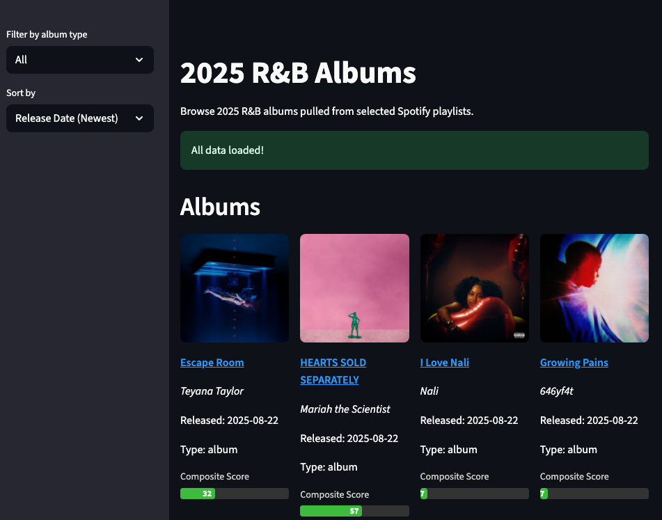

# SpinList: 2025 Spotify Albums & Singles Explorer

SpinList is a Streamlit web app that pulls albums and singles released in 2025 from selected Spotify playlists, enriches them with popularity and listener data from Spotify and Last.fm, and displays them in a sortable, filterable grid. The app computes a composite score for each release, making it easy to compare albums and singles side by side.

# Background

I created SpinList because I wanted a simple way to keep track of album releases for the year. There wasn’t a simple, visual tool that let me browse, filter, and compare new albums and singles in one place—especially with up-to-date stats and an easy to follow scoring system. This project is my solution for music fans who want to stay on top of the year’s releases at a glance.

## Features
- **Spotify Integration:** Fetches albums and singles from user-defined Spotify playlists using the Spotify API.
- **Popularity & Listener Data:** Enriches each release with Spotify popularity and Last.fm listeners/playcount.
- **Composite Score:** Calculates a composite score for each album/single, normalizing for release date and number of tracks, so new releases and singles are fairly compared to older, longer albums.
- **Sections for Albums & Singles:** Albums and singles are shown in separate sections for easy browsing.
- **Filtering & Sorting:** Filter by album type and sort by release date, name, or composite score.



## How it Works
1. **Fetches Data:**
   - Pulls tracks from specified Spotify playlists.
   - Extracts unique albums and singles released in 2025.
2. **Enriches Data:**
   - Fetches Spotify popularity for each album/single.
   - Fetches Last.fm listeners and playcount for each album/single.
3. **Calculates Composite Score:**
   - Normalizes listeners and playcount by days since release and number of tracks.
   - Combines Spotify popularity, normalized listeners, and playcount into a single score.
4. **Displays Results:**
   - Shows albums and singles in separate grid sections with cover art and composite score bars.
   - Allows filtering and sorting.

## Setup
1. **Clone the repo and install requirements:**
   ```bash
   pip install -r requirements.txt
   ```
2. **Set up your `.streamlit/secrets.toml` with your API keys:**
   ```toml
   [spotify]
   client_id = "YOUR_SPOTIFY_CLIENT_ID"
   client_secret = "YOUR_SPOTIFY_CLIENT_SECRET"
   [lastfm]
   api_key = "YOUR_LASTFM_API_KEY"
   ```
3. **Run the app:**
   ```bash
   streamlit run app.py
   ```

## Customization
- Edit the playlist IDs in `spotify_data.py` to change which playlists are scanned.
- Adjust the composite score logic in `spotipy_popularity.py` to tweak how scores are calculated.
